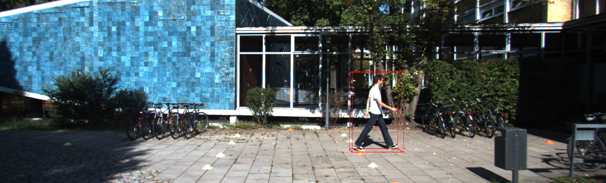
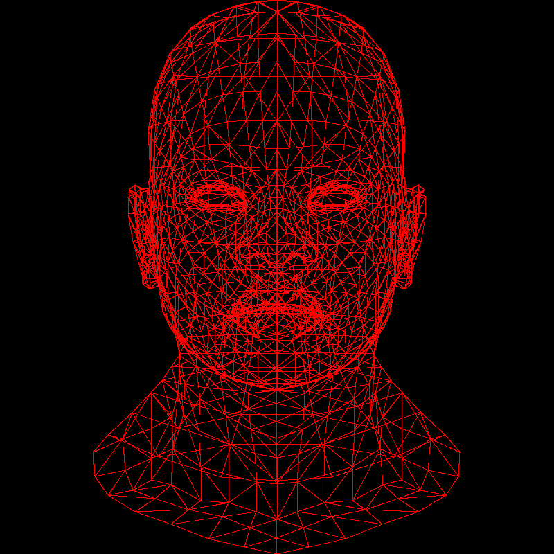
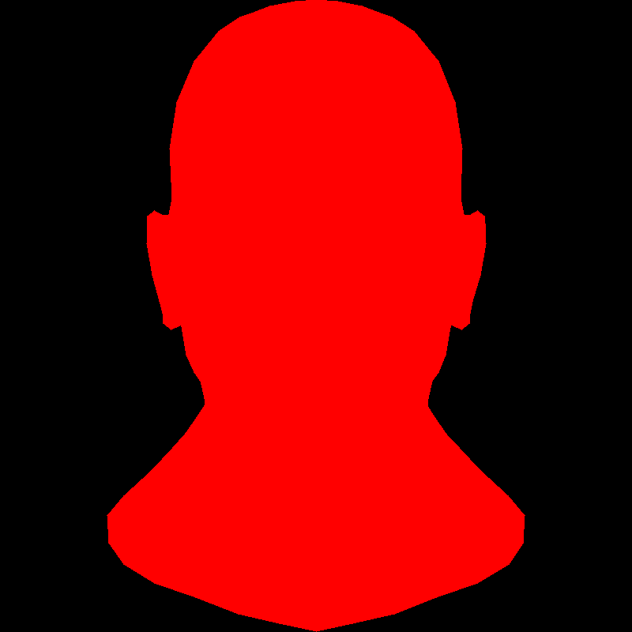
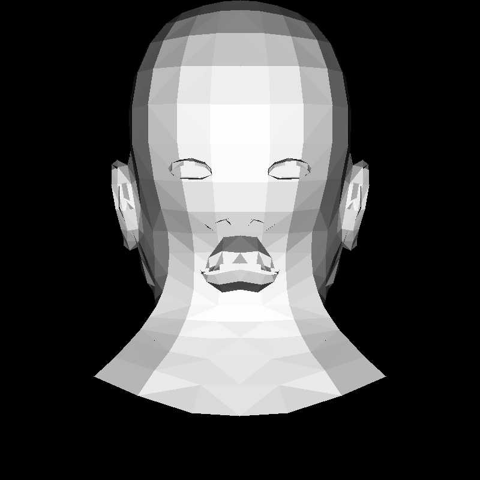
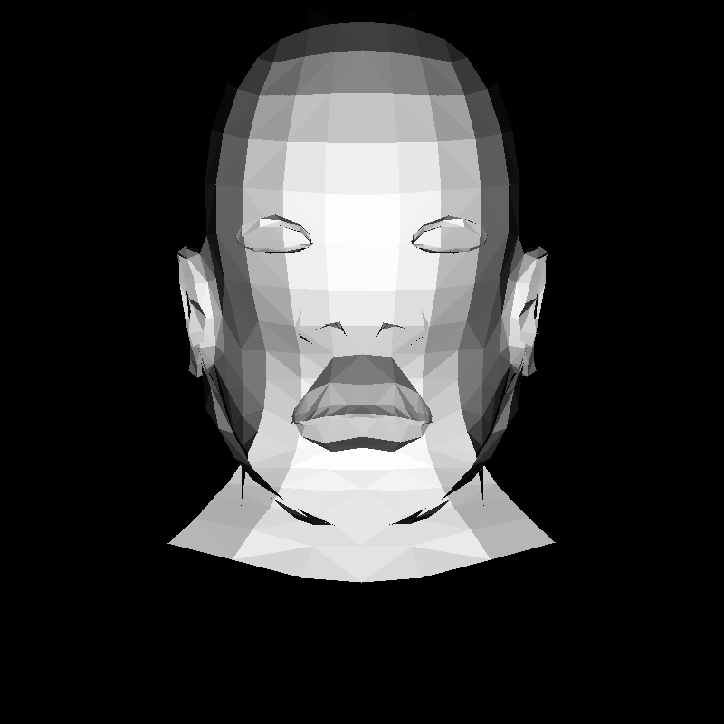

# software-rasterizer

A CPU software 3D renderer built from scratch in C++ with no graphics libraries, plus a camera-reprojection demo that projects 3D bounding boxes onto real KITTI frames using a calibrated pinhole camera model.



## What it does

This renders a 3D triangle mesh to an image entirely on the CPU, implementing every stage of the rasterization pipeline by hand: reading the model, projecting it to the screen, filling triangles, lighting them, and resolving depth. No OpenGL, no GPU, no external graphics code beyond a small TGA image writer.

The second half applies the same projection math to computer vision. Using real camera intrinsics and a 3D object label from the KITTI autonomous-driving dataset, it reprojects a 3D bounding box onto the camera image, the same operation perception systems use to overlay detections onto a scene.

## Pipeline

- OBJ mesh parsing (vertices and faces)
- Bresenham line drawing
- Barycentric triangle filling
- Flat shading from a directional light
- Back-face culling
- Z-buffered depth testing
- Perspective projection
- Pinhole-camera reprojection of 3D boxes onto real images

## Gallery

| Stage | Output |
|-------|--------|
| Wireframe |  |
| Filled triangles |  |
| Flat shading + culling |  |
| Z-buffer |  |
| Perspective |  |
| KITTI reprojection |  |

## Build and run

Renderer:

```
g++ main.cpp tgaimage.cpp -o main && ./main
```

Outputs `output.tga`. Uses the `african_head.obj` model from the [tinyrenderer](https://github.com/ssloy/tinyrenderer) project, placed in `obj/`.

Reprojection demo:

```
g++ reproject.cpp tgaimage.cpp -o reproject && ./reproject
```

Outputs `reproject.tga`. Uses one frame (image, calibration, label) from the KITTI 3D object detection dataset, placed in `kitti/`.

## Notes and limitations

- Shading is flat (one normal per face), so curved surfaces look faceted. Smooth shading with per-vertex normals would fix this.
- The reprojected box is axis-aligned; the object's yaw rotation is ignored, which is fine for near-zero rotations like this frame but would need a rotation applied for angled objects.
- A vertical coordinate flip reconciles the image's stored orientation with the top-left origin the projection assumes.

## Built with

C++17, developed on WSL Ubuntu with g++. TGA image I/O adapted from tinyrenderer.